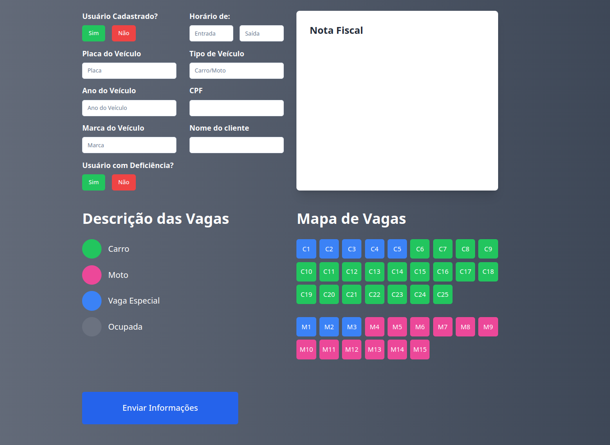

  <a href="#1-catálogo-de-pets-personalizado">
    
    <h1 align="center">SmartPark: Programa para organizar seu estacionamento</h1>
  </a>

## Estacionamento Inteligente 🅿️🚗

### Descrição:

Bem-vindo ao SmartPark!

O SmartPark é uma solução avançada para gerenciamento de estacionamentos que utiliza tecnologias modernas para oferecer uma experiência eficiente e conveniente para os usuários. Nosso sistema integra câmeras e sensores para monitorar a ocupação das vagas em tempo real e oferecer informações precisas sobre disponibilidade de vagas e tipos de veículos permitidos.

Foi projetado para otimizar o uso do espaço, proporcionando aos motoristas uma maneira rápida de encontrar e reservar vagas adequadas ao seu veículo. A arquitetura modular do SmartPark permite uma integração fácil de novos dispositivos e funcionalidades, garantindo escalabilidade e adaptabilidade conforme as necessidades do seu estacionamento.

Com o SmartPark, você pode garantir uma gestão eficiente das vagas, oferecendo serviços personalizados como identificação de placas, controle de tempo de utilização e tarifação automática baseada em critérios específicos. Simplifique a gestão do seu estacionamento com uma solução inteligente e inovadora que melhora a experiência tanto para os usuários quanto para os operadores.

#### Recursos principais:

## Estacionamento Inteligente 🅿️🚗

### Requisitos:

- **Controle Geral de Vagas** 📷🚦
  - Utilização de um Sistema de  ou sensores para identificar ocupação das vagas.
  - Meta: Identificar corretamente em 90% dos casos os veículos nas vagas.
  - Influência em: Requisitos 2, 3 e 8.

- **Tipo de Veículo e Tipo de Vaga** 🚙🔍
  - Identificar vagas disponíveis e seus tipos.
  - Meta: Identificar corretamente a placa do veículo e seu respectivo tipo.
  - Influenciado por: Requisito 1.
  - Influencia: Requisitos 3 e 8.

- **Localização de Vagas** 📍🅿️
  - Identificar o local das vagas e indicar as disponíveis para o veículo/tipo correto.
  - Meta: Identificar e indicar sem falhas as vagas livres.
  - Influenciado por: Requisitos 1 e 2.
  - Influencia: Requisitos 5, 6, 7 e 8.

- **Identificação de Placas** 🚗🔢
  - Identificar a placa do veículo na entrada e saída.

- **Tempo de Utilização da Vaga** ⏱️🕒
  - Marcar a hora de entrada e saída do veículo baseado na placa.

- **Valor Cobrado para Utilização** 💵💳
  - Calcular o valor do estacionamento com base no tempo de estadia, tipo de veículo, tipo de cliente e horário.

- **Plano de Desconto para Clientes Cadastrados** 📋✂️
  - Cadastrar usuários e categorizá-los por plano de pagamento.

- **Identificar Clientes PCD's e condições especiais** ♿👤
  - Identificar usuários PCD's e de outras condições especiais e indicar as vagas reservadas.

[Figma Layout](https://www.figma.com/design/djTVRdp1kwg20cLpZmo0be/Plataforma-de-Cursos?node-id=0-1)

[Projeto em producao](https://atividade-simples-facul.vercel.app/)
